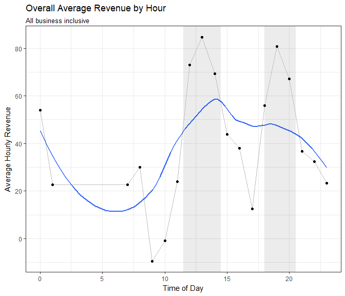
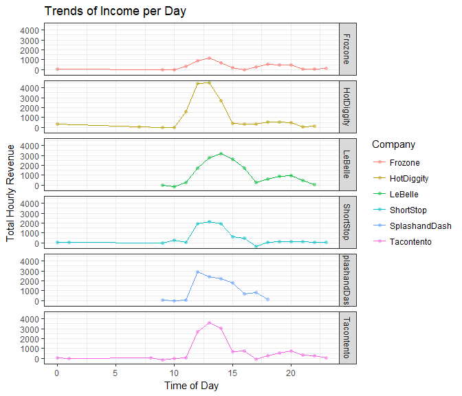
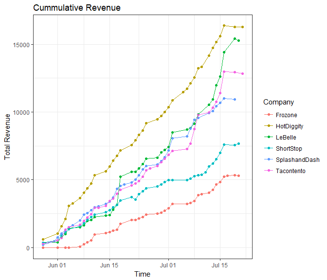

```r
# Use this R-Chunk to import all your datasets!
business <- read_csv("https://byuistats.github.io/M335/data/sales.csv")
```


## Background

We have been approached by a few young businesses looking for loans through our company. We need to decide which business would be the best candidate to enter a contract for our resources. 

## Data Wrangling


```r
business2 <- business %>%
  filter(Name != "Missing") %>%
  mutate(Time = with_tz(ymd_hms(Time), tzone = "America/Denver"),
         Minute = ceiling_date(Time, "minute"),
         Hour = ceiling_date(Time, "hour"),
         Day = ceiling_date(Time, "day"),
         Week = ceiling_date(Time, "week"),
         Month = ceiling_date(Time, "month"))

business1 <- business2 %>%
  filter(week(Time) > 21) 

byminute <- business1 %>%
  group_by(Name, Minute) %>%
  summarise(Revenue = sum(Amount))
  

Hourly <- business1 %>%
  group_by(Name, Hour) %>%
  summarise(Revenue = sum(Amount))

Daily <- business1 %>%
  group_by(Name, Day) %>%
  summarise(Revenue = sum(Amount))

Weekly <- business1 %>%
  group_by(Name, Week) %>%
  summarise(Revenue = sum(Amount))

Monthly <- business1 %>%
  group_by(Name, Month) %>%
  summarise(Revenue = sum(Amount))

Hourly1 <- Hourly %>%
  mutate(Hour = hour(Hour)) %>%
  group_by(Name, Hour) %>%
  summarise(Hourlyrev = sum(Revenue),
            avgHourlyrev = mean(Hourlyrev))
Hourly2 <- Hourly %>%
  mutate(Hour = hour(Hour)) %>%
  group_by(Hour) %>%
  summarise(avgHourlyrev = mean(Revenue))

Weekly1 <- Weekly %>%
  mutate(cumsum = cumsum(Revenue))

Daily1 <- Daily %>%
  mutate(cumsum = cumsum(Revenue))
```

### Hours of Operations

In the graphics below, trends of income are represented by lines and the actual income is represented by points. Values below zero are expenses. The hours of highest income is represented by the grey boxes. 

The first question to concider is the usage of time for these companies. With the graphics below, we have combined all of the businesses together and plotted the average revenue by hour. This plot is somewhat of a representation of the volume of customers based on cashflow.   


```r
ggplot(Hourly2) +
  geom_smooth(aes(x = Hour, y = avgHourlyrev), se = FALSE) + 
  geom_point(aes(x = Hour, y = avgHourlyrev)) +
  geom_line(aes(x = Hour, y = avgHourlyrev), alpha = 0.25) +
  geom_rect(xmin = 11.5 , xmax = 14.5, ymin = -Inf, ymax = Inf, alpha = 0.005) +
  geom_rect(xmin = 18, xmax = 20.5, ymin = -Inf, ymax = Inf, alpha = 0.005) +
  theme_bw() + 
  labs(x = "Time of Day",
       y = "Average Hourly Revenue", 
       title = "Overall Average Revenue by Hour",
       subtitle = "All business inclusive")
```

<!-- -->

We see that the average amount of income per hour is found between 11:30am and 2:30pm and then again at 6:00pm to 8:30pm. The peaks would suggest that there is as much revenue coming in at both those times, but the volume of total revenue is significantly lower as represented in the next graphic. I would suggest that the best time for revenue with these businesses is between 11:30am and 2:30pm.

### Comparisons

In this plot, the total income over the course of three months was combined by hour and plotted against eachother. From this plot, we can see at what time the company gets their revenue.


```r
# Use this R-Chunk to clean & wrangle your data!
ggplot(Hourly1) + 
  geom_point(aes(x = Hour, y = Hourlyrev, color = Name), alpha = 0.5, pch = 16) +
  geom_line(aes(x = Hour, y = Hourlyrev, color = Name, group = Name)) +
  facet_grid(Name~.) +
  #geom_smooth(aes(x = Hour, y = avgHourlyrev, color = Name), se = FALSE) +
  theme_bw() + 
  labs(x = "Time of Day",
       y = "Total Hourly Revenue", 
       title = "Trends of Income per Day",
       color = "Company")
```

<!-- -->

We see that all of the companies show a similar trend for the time at which they create revenue. We see that HotDiggity is the most popular during the spike. It seems that Splash and Dash is open for a shorter amount of time during the day and Lebelle is open for a little longer. Frozone is consistant throughout the day, but doesn't seem to be making as much money.

### Total Revenue

The cummulative sum of each company over time was calculated and plotted against time. From this we can see who is making the most money overall and ther trends within. 


```r
ggplot(Daily1) +
  geom_point(aes(x = Day, y = `cumsum`, color = Name)) +
  geom_line(aes(x = Day, y = `cumsum`, color = Name, group = Name)) +
  theme_bw() + 
  labs(x = "Time",
       y = "Total Revenue", 
       title = "Cummulative Revenue",
       color = "Company")
```

<!-- -->

We see that HotDiggity is doing the best overall. They have been consistantly making more revenue and haven't had any dips or plateaus. LaBell has been just about as consistant as HotDiggity, but began to catch up during the last 2 weeks or so. From the data, I would recommend that we offer the loan to HotDiggity because of their consistancy, and LeBelle because of their spike towards the end. 

