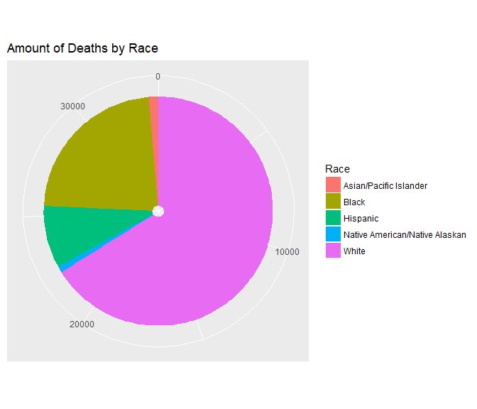
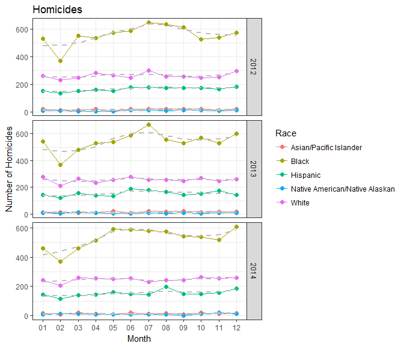
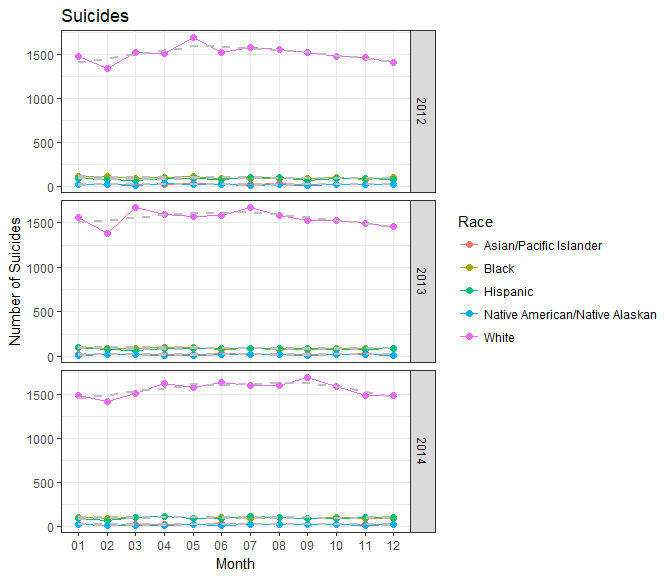
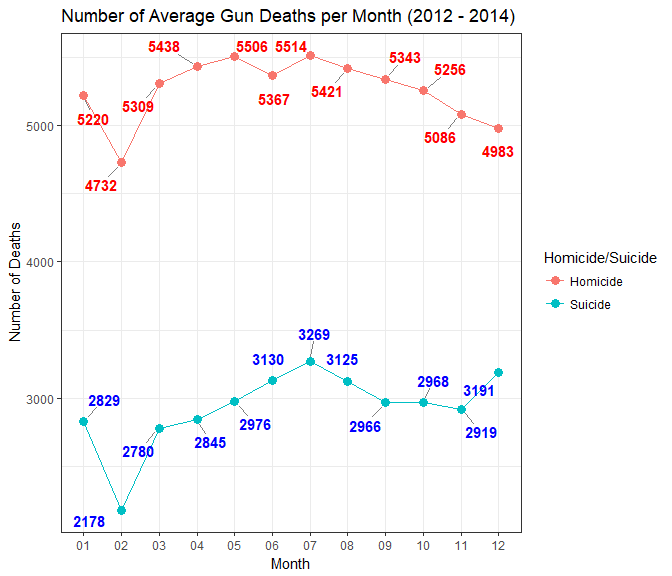

```r
# Use this R-Chunk to import all your datasets!
guns <- read_csv("https://github.com/fivethirtyeight/guns-data/raw/master/full_data.csv")
```
## Reading Summary

Best practices. You always need to make sure that you are looking through every graphic and not just allowing things to be there just because it's default. To make sure you are relaying the correct graphic, you need to determine several aspects of your project. What message do you want to convey, what kind of graphics are you going to use and how you're going to use it. 


## FiveThirtyEight Summary


Guns deaths are not only about terrorist acts or mass shootings. Most of them are suicides. There are several factors that consitute those who are victims of gun violence and just addressing the issue of terrorist acts isn't enough to stop gun deaths. 


```r
racecount <- guns %>%
  filter(year == 2013) %>%
  group_by(race) %>%
  summarise(countr = n()) %>%
  mutate(nothing = c(NA,NA,NA,NA,NA))

pie <- racecount %>%
  ggplot(aes(x = nothing)) +
  geom_bar(aes(fill = race, weight = countr))

pie +
  coord_polar(theta = "y") +
  theme(axis.title.x = element_blank(),
        axis.title.y = element_blank(),
        axis.text.y = element_blank(),
        axis.ticks.y = element_blank()) +
  labs(fill = "Race",
       title = "Amount of Deaths by Race")
```

<!-- -->

## Background

With the increase of gun violence in the United States over the last couple years, there is some debate about how to counter this problem. One of the ways to do this to create specific commercials throughout the year to specific demographics and air these commercials at specific times to maximize efficiency. 

## Data Wrangling


## Data Visualization

From these graphs, we compare the number of homicides in each year by the race of the victim. From this we can see a timeline and comparison of those who are the victims of homicide. 


```r
# Use this R-Chunk to plot & visualize your data!

races_year %>%
  ggplot(aes(month, racecount)) +
  facet_grid(year~.,scales = "free_y") + 
  geom_point(aes(color = race), size = 2) +
  geom_line(aes(color = race, group = race), size = 0.10) +
  labs(x = "Month", 
       y = "Number of Homicides",
       title = "Homicides",
       color = "Race") +
  theme_bw() +
  geom_smooth(aes(group = race), linetype = "dashed", color = "grey", se = FALSE) +
  guides(size = "none")
```

<!-- -->

From these graphs, we compare the number of suicides in each year by the race of the victim. From this we can see a timeline and comparison of those who are the victims of suicide. 


```r
races_year_suicide %>%
  ggplot(aes(month, racecount_suicide)) +
  facet_grid(year~.,scales = "free_y") + 
  geom_point(aes(color = race), size = 2) +
  geom_line(aes(color = race, group = race), size = 0.10) +
  labs(x = "Month",
       y = "Number of Suicides",
       title = "Suicides",
       color = "Race") +
  theme_bw() +
  geom_smooth(aes(group = race), linetype = "dashed", color = "grey", se = FALSE) +
  guides(size = "none")
```

<!-- -->

From this graph, we take the average number of deaths by homicide and suicide on a timline. We can see the frequency of different types of death by month to determine times of the year when gun deaths are more common.  


```r
ggplot() + 
  geom_point(data = meanworaces, aes(month, rmean, color = 'red'), size = 3) +
  geom_line(data = meanworaces, aes(month, rmean, color = 'red', group = 1), size = 0.25) +
  geom_text_repel(data = meanworaces, aes(month, rmean, label = paste(rmean)),
                    fontface = "bold", color = "blue",
                    box.padding = 0.35, point.padding = 0.5,
                    segment.color = 'grey50') +
  geom_point(data = meanworaces_suicide, aes(month, rmean_suicide, color = "blue"), size = 3) +
  geom_line(data = meanworaces_suicide, aes(month, rmean_suicide, color = "blue", group = 1), size = 0.25) +
  geom_text_repel(data = meanworaces_suicide, aes(month, rmean_suicide, label = paste(rmean_suicide)), 
                  fontface = "bold", color = "red", 
                  box.padding = 0.35, point.padding = 0.5,
                  segment.color = 'grey50') +
  scale_color_discrete(name = "Homicide/Suicide",
                       labels = c("Homicide", "Suicide")) +
  labs(
      x = "Month", 
      y = "Number of Deaths", 
      title = "Number of Average Gun Deaths per Month (2012 - 2014)",
      color = "Homicide/Suicide") +
  theme_bw()
```

<!-- -->

## Conclusions

From these graphics, we see that the victims of homicide are black and it has been this way over the course of these three years. WE also see that the amount of homicides goes up during the summer months and is significantly lower in February. 

We see that the amounts of suicides is less than homicides but the trend of when these deaths happens follows that of homicides - they increase during the summer months, except for December when suicides are almost highest in the year.

To combat gun violence, I would recommend creating a commercial that would be geared towards black communities that would air during the summer months (05 - 09). I would also recommend suicide prevention commercials that appeals towards white communities during that same general time, but more specifically around June and July. 

