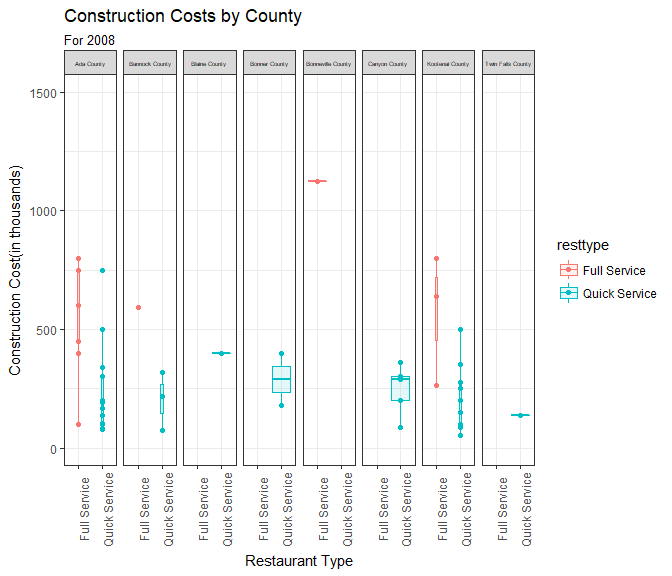
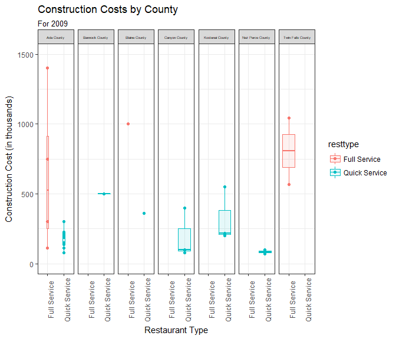
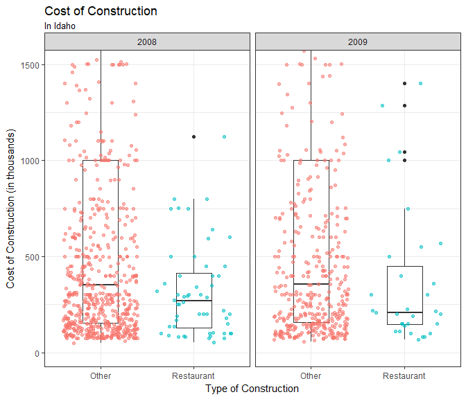
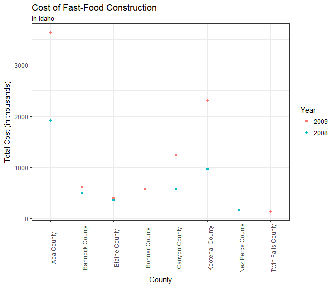
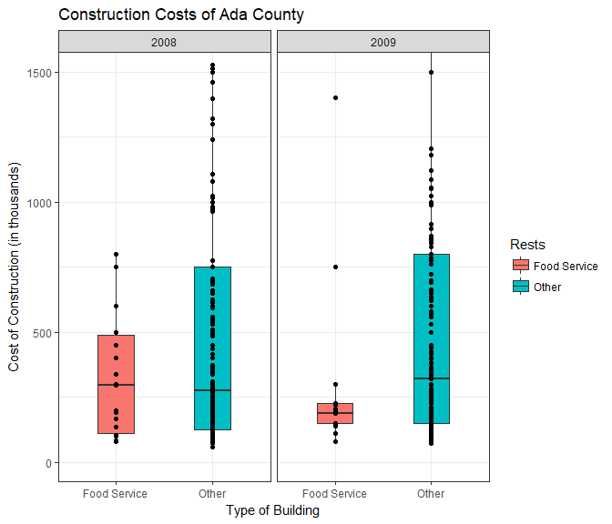

```r
# Use this R-Chunk to import all your datasets!
library(buildings)
```

## Background

We have been given several questions regarding construction projects throughout Idaho. The questions have been divided and concluded in the graphics below. 

## Data Wrangling


```r
not_restaurants <- str_to_lower(str_trim(c("development","Food preperation center", "Food Services center","bakery","Grocery","conceession","Cafeteria", "lunchroom","school","facility"," hall ")))
standalone_retail <- str_to_lower(str_trim(c("Wine","Spirits","Liquor","Convenience","drugstore","Flying J", "Rite Aid ","walgreens ","Love's Travel ")))
full_service_type <- str_to_lower(str_trim(c("Ristorante","mexican","pizza ","steakhouse"," grill ","buffet","tavern"," bar ","waffle","italian","steak house")))
quick_service_type <- str_to_lower(str_trim(c("coffee"," java "," Donut ","Doughnut"," burger ","Ice Cream ","custard ","sandwich ","fast food "," bagel ")))
quick_service_names <- restaurants$Restaurant[restaurants$Type %in% str_to_lower(str_trim(c("coffee","Ice Cream","Fast Food")))]
full_service_names <- restaurants$Restaurant[restaurants$Type %in% str_to_lower(str_trim(c("Pizza","Casual Dining","Fast Casual")))]
```


```r
# Use this R-Chunk to clean & wrangle your data!
#2

buildingclimate <- buildings0809 %>%
  left_join(climate_zone_fips, by = c("FIPS.state", "FIPS.county")) %>%
  filter(Type == "Food_Beverage_Service")

buildswithname <- buildings0809 %>%
  left_join(climate_zone_fips, by = c("FIPS.state", "FIPS.county"))

finding <- function(x){
  str_detect(str_to_lower(str_trim(buildingclimate$ProjectTitle)), paste(x, collapse = "|"))
}

builds <- buildingclimate %>%
  mutate(resttype = case_when(
    finding(not_restaurants) ~ "Not A Restaurant",
    finding(standalone_retail) ~ "Standalone", 
    finding(c(full_service_names, full_service_type)) ~ "Full Service",
    finding(c(quick_service_type, quick_service_names)) ~ "Quick Service",
    SqFt >= 4000 ~ "Full Service",
    SqFt < 4000 ~ "Quick Service")
  )


builds08 <- builds %>%
  filter(resttype == "Quick Service", Year == 2008) %>%
  group_by(AreaName, Year) %>%
  summarise(totalcost = sum(Value1000)) %>%
  ungroup()
    
builds09 <- builds %>%
  filter(resttype == "Quick Service", Year == 2009) %>%
  group_by(AreaName, Year) %>%
  summarise(totalcost = sum(Value1000)) %>%
  ungroup()

builders <- buildings0809 %>%
  mutate(typers = case_when(
    Type == "Food_Beverage_Service" ~ "Restaurant",
    Type != "Food_Beverage_Service" ~ "Other"
  ))

ADA <- buildswithname %>%
  filter(AreaName == "Ada County") %>%
  mutate(Rests = case_when(
      Type == "Food_Beverage_Service" ~ "Food Service",
      Type != "Food_Beverage_Service" ~ "Other"
  ))
```

## Data Visualization

### Question 1 : How did full-service restaurant construction compare to quick service restaurant construction across county and years?

The plots below show the cost of construction for Food, Beverage and Service Restaurants classed by Full Service and Quick Service. Missing values mean there were no restaurants of that type built in that specific county. Lines mean there was only one restaurant of that type built within the county. 

Concluding, we see that Quick Service is more frequent but Full Service has higher costs. 


```r
# Use this R-Chunk to plot & visualize your data!

builds %>%
  filter(Year == 2008, resttype != "Not A Restaurant") %>%
  ggplot() +
  geom_point(aes(x = resttype, y = Value1000, color = resttype, fill = resttype)) +
  geom_boxplot(aes(x = resttype, y = Value1000, color = resttype, fill = resttype), alpha = 0.1) +
  facet_grid(~AreaName) +
  theme_bw() +
  theme(axis.text.x = element_text(angle = 90),
        strip.text = element_text(size = 4.75)) +
  labs(
    x = "Restaurant Type",
    y = "Construction Cost(in thousands)",
    title = "Construction Costs by County",
    subtitle = "For 2008"
  ) +
  coord_cartesian(ylim = c(0, 1500))
```

<!-- -->

```r
builds %>%
  filter(Year == 2009, resttype != "Not A Restaurant") %>%
  ggplot() +
  geom_point(aes(x = resttype, y = Value1000, color = resttype, fill = resttype)) +
   geom_boxplot(aes(x = resttype, y = Value1000, color = resttype, fill = resttype), alpha = 0.1) +
  facet_grid(~AreaName) +
  theme_bw() +
  theme(axis.text.x = element_text(angle = 90),
        strip.text = element_text(size = 4.75)) +
  labs(
    x = "Restaurant Type",
    y = "Construction Cost (in thousands)",
    title = "Construction Costs by County",
    subtitle = "For 2009"
  ) +
  coord_cartesian(ylim = c(0, 1500))
```

<!-- -->

### Question 2 : How did restaurant construction fare compare to the other commercial construction in Idaho?

In the plot below, the total cost of construction for each commercial construction project is represented by a dot. Restaurant and all other construction projects have been separated. 

Concluding, we see from the overlayed box plots that the mean cost of restaurant projects was less than other projects in 2008 and 2009.


```r
ggplot() + 
  geom_boxplot(data = builders, aes(x = typers, y = Value1000)) +
  geom_jitter(data = builders, aes(x = typers, y = Value1000, alpha = 0.01, color = typers)) +
  facet_grid(~Year) +
  coord_cartesian(ylim = c(0, 1500)) + 
  theme_bw() +
  labs(
    x = "Type of Construction",
    y = "Cost of Construction (in thousands)",
    title = "Cost of Construction",
    subtitle = "In Idaho",
    color = "Type"
  ) +
  theme(legend.position = "none")
```

<!-- -->

### Question 3 :  Which county in Idaho spent the most on fast food construction each year?


Below, we see the total combined costs of Fast-Food projects by county.

Concluding, we see that Ada County was greatest for both 2008 and 2009.


```r
ggplot() +
  geom_point(data = builds09, aes(x = reorder(AreaName, totalcost), y = totalcost, color = "red")) +
  geom_point(data = builds08, aes(x = reorder(AreaName, totalcost), y = totalcost, color = "blue")) +
  theme_bw() +
  theme(axis.text.x = element_text(angle = 90)) +
  labs(
    x = "County",
    y = "Total Cost (in thousands)",
    color = "Year",
    title = "Cost of Fast-Food Construction",
    subtitle = "In Idaho"
    ) +
  scale_color_discrete(name = "Year",
                       labels = c("2009", "2008"))
```

<!-- -->

### Question 4 : In that county how did other commercial construction compare?

Plotted below, all construction projects in Ada County are separated by Food Service and other projects. 

Concluding, we see that in 2008 the average cost for Food Service Projects exceeds Other Projects. In 2009, Other Projects exceeds Food Service Projects. Overall, there are a higher number of Other Projects that exceed $500,000. 


```r
ggplot() +
  geom_boxplot(data = ADA, aes(x = Rests, y = Value1000, fill = Rests)) +
  geom_point(data = ADA, aes(x = Rests, y = Value1000)) +
  facet_grid(~Year) + 
  coord_cartesian(ylim = c(0, 1500)) + 
  labs(
    x = "Type of Building", 
    y = "Cost of Construction (in thousands)",
    title = "Construction Costs of Ada County"
  ) +
  theme_bw()
```

<!-- -->

