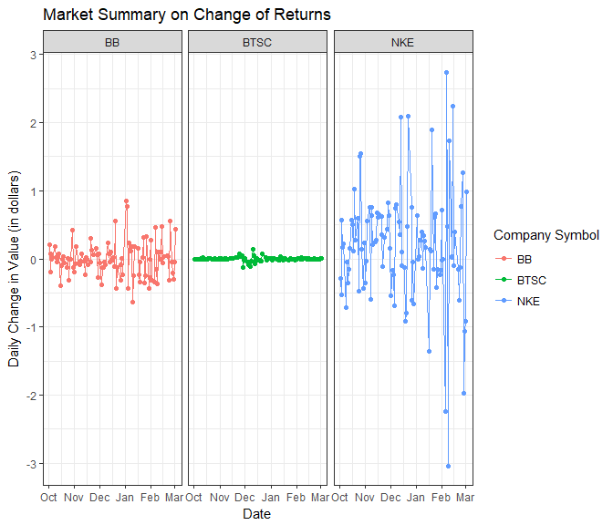

```r
# Use this R-Chunk to import all your datasets!

#This is for my data. I chose Nike, Bic, and Bitcoin

returns <- c("NKE", "BB", "BTSC") %>%
  tq_get(get  = "stock.prices",
         from = "2017-10-01",
         to   = "2018-03-05") %>%
  group_by(symbol) %>%
  mutate(travelsum = cumsum(adjusted),
         dailychange = close - open)

#This is for my friend. He chose Life Time Fitness, Walmart and FedEx.

friend <- c("LTM", "WMT", "FDX") %>%
  tq_get(get  = "stock.prices",
         from = "2017-10-01",
         to   = "2018-03-05") %>%
  group_by(symbol) %>%
  mutate(travelsum = cumsum(adjusted),
         dailychange = close - open)
```

## Background

My friend and I have invested $1000 in 3 separate companies each and are recording how we've done since we invested in October. I invested into 

* Nike - NKE
* BIC - BB
* Bitcoin - BRSC

My friend invested in 

* Walmart - WMT
* FedEx - FDX
* Life Time Fitness - LTM

## Data Wrangling


```r
# Use this R-Chunk to clean & wrangle your data!
```

## Data Visualization

In this plot, we calculated our cumulated sums for all 3 of the companies that we each invested in and ploted them over time. The points represent the value of our investements from the starting date. The line represents the general direction of the values.


```r
mine <- returns %>%
  group_by(date) %>%
  summarise(score = as.numeric(sum(dailychange))) %>%
  ungroup() %>%
  mutate(date = ymd(date),
    travelingsum = cumsum(score)) 

his <- friend %>%
  group_by(date) %>%
  summarise(score = as.numeric(sum(dailychange))) %>%
  ungroup() %>%
  mutate(date = ymd(date),
         travelingsum = cumsum(score))

mysmooth <- geom_smooth(data = mine, aes(x = date, y = travelingsum), se = FALSE, color = "red")
hissmooth <- geom_smooth(data = his, aes(x = date, y = travelingsum), se = FALSE, color = "blue")

ggplot() + 
  mysmooth +
  hissmooth +
  geom_point(data = mine, aes(x = date, y = travelingsum), alpha = 0.3, color = "red") + 
  geom_point(data = his, aes(x = date, y = travelingsum), alpha = 0.3, color = "blue") +
#+geom_line(data = mine, aes(x = date, y = travelingsum), alpha = 0.3, color = "red") +
  #geom_line(data = his, aes(x = date, y = travelingsum), alpha = 0.3, color = "blue")
  labs(x = "Date", 
       y = "Cummulated Sum of Values",
       title = "Me vs. Friend Cummulated Value Over Time",
       subtitle = "Red - Me, Blue - Friend") +
  theme_bw()
```

<!-- -->

```r
#ggplot() + 
 # geom_point(data = mine, aes(x = date, y = travelingsum), color = "blue") + 
  #geom_smooth(data = mine, aes(x = date, y = travelingsum))

#ggplot() +
 # geom_point(data = his, aes(x = date, y = travelingsum), color = "red") +
  #geom_smooth(data = his, aes(x = date, y = travelingsum))
```

We see that my friend is being faced with misfortune as his value dips almost all the way down to where it was in October. I seem to have a steady increase but am leveling out. I obviously did better than my friend. 

## Graphics

In the first plots, we have the values of the stocks for the companies plotted against eachother. In the second plots, we see the change in the value of the stock each day. A wide spread of data on the Y axis represents a higher risk because the stock may be worth more, but it can also looks just as much value. 

## Me


```r
# Use this R-Chunk to plot & visualize your data!

returns %>%
  ggplot() +
  geom_point(aes(x = date, y = adjusted, group = symbol, color = symbol)) + 
  geom_line(aes(x = date, y = adjusted, group = symbol, color = symbol)) + 
  theme_bw() + 
  labs(
    x = "Date", 
    y = "Stock Value (in dollars)",
    title = "Market Summary on Returns",
    color = "Company Symbol"
  )
```

<!-- -->


```r
returns %>%
  ggplot() +
  geom_point(aes(x = date, y = dailychange, group = symbol, color = symbol)) + 
  geom_line(aes(x = date, y = dailychange, group = symbol, color = symbol)) + 
  facet_grid(~symbol) +
  theme_bw() + 
  labs(
    x = "Date", 
    y = "Daily Change in Value (in dollars)",
    title = "Market Summary on Change of Returns",
    color = "Company Symbol"
  )
```

<!-- -->

We see that the companies I invested in maintain an upward trend. Bitcoin is very low but very consistant. It doesn't seem that there's not much to be had in terms of investment for Bitcoin. BIC seems to be steady, but has no increase. Nike is continually improving.

## My Friend 


```r
friend %>%
  ggplot() +
  geom_point(aes(x = date, y = adjusted, group = symbol, color = symbol)) + 
  geom_line(aes(x = date, y = adjusted, group = symbol, color = symbol)) + 
  theme_bw() + 
  labs(
    x = "Date", 
    y = "Stock Value (in dollars)",
    title = "Market Summary on Returns",
    color = "Company Symbol"
  )
```

<!-- -->


```r
friend %>%
  ggplot() +
  geom_point(aes(x = date, y = dailychange, group = symbol, color = symbol)) + 
  geom_line(aes(x = date, y = dailychange, group = symbol, color = symbol)) + 
  facet_grid(~symbol) +
  theme_bw() + 
  labs(
    x = "Date", 
    y = "Daily Change in Value (in dollars)",
    title = "Market Summary on Change of Returns",
    color = "Company Symbol"
  )
```

<!-- -->

Life Time Fitness seems to be in the same scenerio. It's consistant, but isn't going anywhere. Walmart's stock doesn't seem expensive, but it still more expensive than Nike's stock and it is moving up in general. FedEx stock is very expesive at over $200 per stock. There seems to have been some great returns, but they took a big dip in mid January. This correlates with the big overall dip that my friend took in the first graphic.

## Conclusions

I am doing better with my investments than my friend. We see a general trend that the higher the price of the stock - the greater the variability and the higher the risk and the reward. This didn't work well for my friend.
